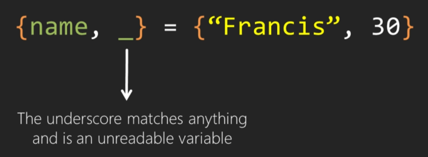

# Getting Start With Elixir

## Design Goals
* Compatibility
* Productivity
* Extensibility

## Characteristics
* General Purpose
  * Suitable for multiple application types.
* Functional
  * Adheres mostly to the functional paradigm, but not only.
* Actor Model
  * Processes are akin to Actors, encapsulating data (state), receiving and sending messages.
* Dynamically Typed
  * Types are interred in compile and run-time.
* Compiled
  * The compiler generates code that is executed by the BEAM (Erlang VM).

## Use Cases
### Good
* General applications.
* Large scale services.
* Web applications.
### Not good
* Systems programming.
* Scripting.

## Functional Programming
### What is functional programming?
* Evaluation of expressions.
* Promotes immutable state.
* Behaves more closely to their mathematical counterpart.
* It is first-class citizen (i.e. can be returned from functions and passwd as argument).
### Motivation
* Better structuring discipline.
* No side effects reduce number of bugs.
* Suitable for parallelism.
### Characteristics
* Higher order functions:
  * Functions as return values and as parameters to other functions.

* Recursion:
  * Allowing a function to call itself or looping algorithms.

* Referential Transparency:
  * Some evaluation = some outcome


## Basic Types and Operators
* Literal types
* Basic operators
* Collection types
* Functions to manipulate collections

### Numbers and Arithmetic Operators
#### Integer
* Integer
  * 1
  * -30
* Floating point
  * 1.54932
  * 1.5e-15
* Integer Bases

* Integer - Separator
  * 43312209
  * 43_312_209
* Precision 
#### Operators

* Integer Division Functions

#### boolean
* True
  * Everything is truthy.
* False
  * nil is false.
* strict
  * `and, or, not`
* non-strict
  * `&&, ||, !`
* Comparison Operators
  * `>, <, >=, <=, !=, !==, ==, ===`

```elixir
15.0 == 15 # true
15.0 === 15 # false
```
* Not just for numbers
  * number < atom < reference < function < port < pid < tuple < map < list < bitstring
* Multiple types can be compared with one another by this order.
### Strings
#### Some functions
* String.reverse
* String.replace
#### Atoms
* A constant whose name is its value.
  * :hello
  * :Hey_you
  * :">_<"
  
## Collection Types
### Lists
* An ordered collection of items
* Delimited by square brackets
* An empty lis, `[]`
```elixir
lst = [:hello, "hey", 4]
```

```elixir
hd([1,2,3,4,5]) # 1
tl([1,2,3,4,5]) # [2,3,4,5]
tl([1]) # []
```
* The Cons Cell


* Concatenation
  * ++
* Subtraction
  * --
```elixir
[:hello, "hey", 4] ++ [0.5] # [:hello, "hey", 4, 0.5]
[:hello, "hey", 4] -- ["hey"] #[:hello, 4]
[:hello, :hello] -- [:hello] # [:hello]
```
### Tuple
* An ordered collection of items
```elixir
{:hello, "hey", 4}
```
#### Functions
* Index
  * elem/2
* Size
  * tuple_size/1
* Replacement
  * put_elem/3
```elixir
elem({:hello, "hey", 4}, 0) # :hello
elem({:hello, "hey", 4}, 2) # "hey"
put_elem({:hello, 2}, 1, :hey) # {:hello, :hey}
```
### Lists vs. Tuples

### Keyword Lists
* Indexing
```elixir
list = [red: 2, green: 4, blue: 3]
list[:red] # 2
list[:blue] # 3
list[:yellow] # nil
```
* Still lists
  * Indexing is slow
  * Ordered
### Maps
An unordered collection of values indexed by keys.
```elixir
%{:red => 2, :green => 4}
```
* `map[key]`
  * Works with any type of key.
* `map.key`
  * Works only on keys that are atoms.
* `%{map | key => value}`
  * Works with any type of key.
* `%{map | key: value}`
  * Works only on keys that are atoms.
### Maps - Updating
```elixir
map = %{:x => 1, "y" => 2}
%{map | x: 4}
map.x # 1
```
### Immutability
* Collections are Immutable
  * Any modification on a collection returns a new collection.
### Summary
* Literal types in Elixir
  * Number
  * String
  * Atom
* Collection types in Elixir
  * List
  * Tuple
  * Map
* Functions to manipulate these types
* Immutability of collections
* How to compose types to make more complex ones

## Pattern Matching
Assign the value of the list to the variable named `list`.
```elixir
list = [1,2,3,4,5]
```
### The Match Operator


### Matching Rules


### Pin Operator

```elixir
x = "hello"
x = "hey"
^x = "apple" # error
```

## Forms of Pattern Matching
### Pattern Matching Revisited

```elixir
[x, 2, 3] = [1, 2, 3]
x # 1
```

```elixir
[x|[2,3]] = [1, 2, 3]
```



### A New Type
```elixir
<<1, 2, 3>> <> <<4>>
<<1, 2, 3, 4>>
```

```elixir
<<65, "broad">> # "Abroad"
```
### A New Problem

```elixir
<<0xCAFE::16,
width::16,
height::16,
pixel_size,
image_data::binary>> = <<...>>
```

## Functions
### What is a function?

### Why functions?
* Reuse computations
* Combine to express more powerful computations
### A function in Elixir


### Function Notation
Elixir allows the definition of functions with the same name but with different arity.
### Default Arguments

### Chaining Function Calls

```elixir
person |> full_name |> say_hello("jeff")
```
Inject the value on the left as the first argument of the function on the right.


## Modules
A group of closely related functions.
### Modules in Elixir

### Calling a function from a module
```elixir
BasicMath.add(2, 5) # 7
```
### Composing Modules


* alias
  * Reference a module by different name.
* import
  * Include the functions of a module.
### Private functions

### Constants


## Pattern matching in functions
### The Factorial Function
```elixir
def fact(n) do
  if (n > 0) do
    n * fact(n - 1)
  else
    1
  end
end
```
This is perfectly fine, but we can do better.
```elixir
def fact(0) do
  1
end
def fact(n) do
  n * fact(n - 1)
end
```
### Pattern Matching
```elixir
def process({:ok, result}) do
  result
end
def process({:error, _}) do
  :failure
end
def process(_) do
  :unknown
end
```
### Guard Clauses
```elixir
def fact(n) when is_integer(n) and n > 0 do
  n * fact(n - 1)
end
```
### The final Factorial Function
```elixir
def fact(0) do
  1
end
def fact(n) when is_integer(n) and n > 0 do
  n * fact(n - 1)
end
def fact(_) do
  0
end
```


